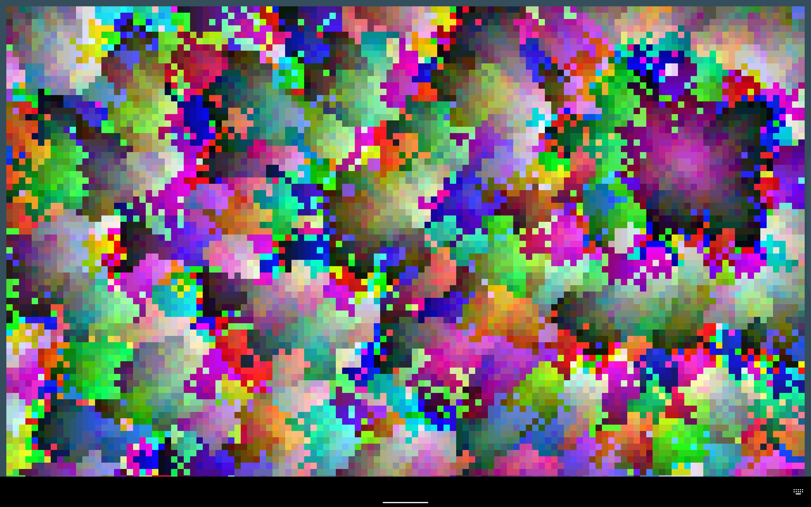
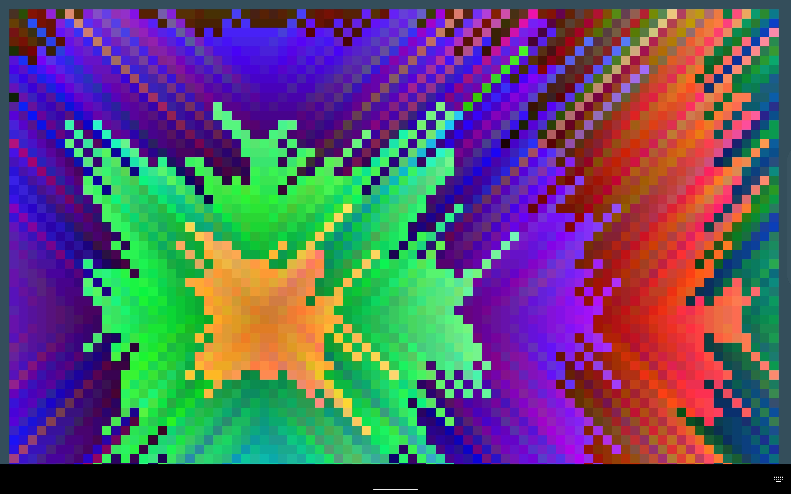
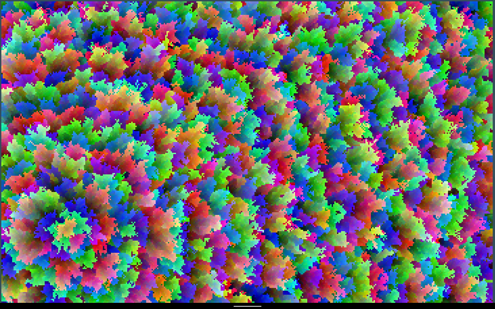

# PixelArt Generator

**Número da Lista**: X 
**Conteúdo da Disciplina**: Grafos 1 

## Alunos
|Matrícula | Aluno |
| -- | -- |
| 18/0121995  |  Herick de Carvalho Lima |
| 19/0054832  |  Arthur Talles de Sousa Cunha |

## Sobre 
O gerador de pixelart utiliza algoritmos de grafos (BFS e DFS) para criar lindos desenhos aleatórios na tela. 

## Screenshots

## Instalação 
**Linguagem**: Python 

## Uso 
Para utilizá-lo é necessário:

1. Clonar o repositório

    SSL:
    $ git clone git@github.com:hericklima22/PixelArtWithGraphs.git
    
    HTTPS:
    $ git clone https://github.com/hericklima22/PixelArtWithGraphs.git

3. Instalar o Python

    $ sudo apt-get install python3

4. Instalar a biblioteca pygame
   
    pip install pygame

3. Executar em sua máquina
   
    python3 main.py

Para uma explicação mais detalhada: o código inicia com uma área quadrada de tamanho variável, onde cada pixel é um nó de um grafo. Ao clicar em qualquer nó, o código pega as coordenadas deste nó, e o algoritmo selecionado se inicia neste ponto com uma reação em cadeia de cores lindas e geradas proceduralmente, a partir da cor do nó visitado anteriormente. Como os algoritmos utilizam filas para selecionar vizinhos, nós podemos brincar com isso ao selecionar vizinhos aleatórios na fila, deixando a arte bem mais interessante, com poucos padrões aparentes.

